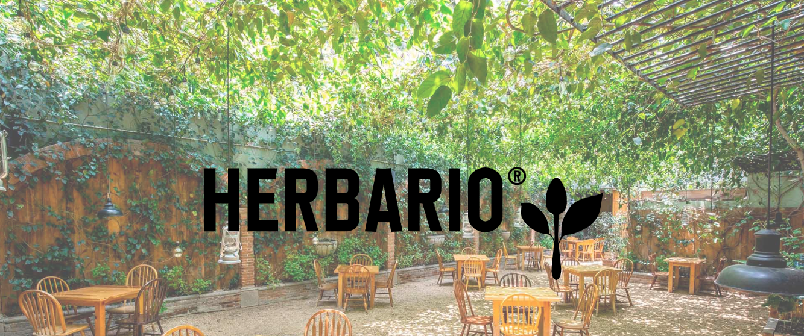

<h1 align="center">👋 RestauranteDjango - Taller Cesde 🚀</h1>

## Overview



### Built With

- [Python]
- [Django]
- [Bootstrap]

## How To Use

```bash
# Clone this repository
$ git clone https://github.com/LuisC73/restauranteDjango.git

#Run the project

python -m venv modules

cd modules

cd Scripts

activate

cd .. x2

pip install django

pip freeze

cd config

python manage.py runserver

```
